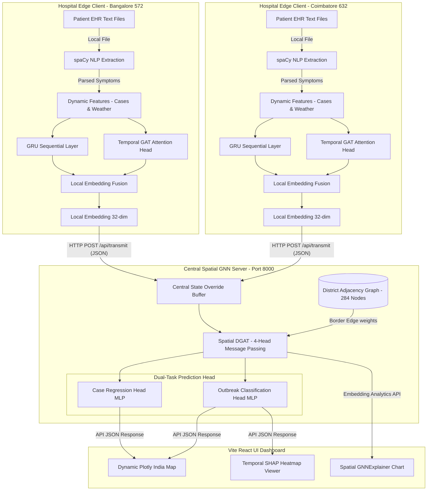
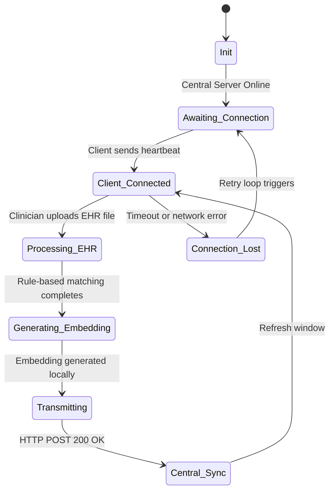

# FedXGNN: Explainable Split-Federated Graph Epidemic Intelligence

A split-federated spatio-temporal graph neural network architecture that forecasts Dengue outbreak risk and weekly case loads across 284 Indian districts, enabling privacy-preserving cooperative disease surveillance with client-side local temporal learning and server-side spatial graph message passing.

[](https://github.com/google-deepmind)
[](LICENSE)
[](https://python.org)
[](https://pytorch.org)
[](https://open-meteo.com)

---

## SECTION 2 — TABLE OF CONTENTS

- [SECTION 1 — HEADER BLOCK](#fedxgnn-explainable-split-federated-graph-epidemic-intelligence)
- [SECTION 2 — TABLE OF CONTENTS](#section-2--table-of-contents)
- [SECTION 3 — PROJECT OVERVIEW](#section-3--project-overview)
  - [3a. The Problem](#3a-the-problem)
  - [3b. The Solution](#3b-the-solution)
  - [3c. Why This Approach](#3c-why-this-approach)
  - [3d. Scope & Intended Users](#3d-scope--intended-users)
- [SECTION 4 — SYSTEM ARCHITECTURE](#section-4--system-architecture)
  - [4a. Architecture Diagram](#4a-architecture-diagram)
  - [4b. Layer / Component Breakdown](#4b-layer--component-breakdown)
  - [4c. End-to-End Data Flow](#4c-end-to-end-data-flow)
  - [4d. Concurrency & Timing Model](#4d-concurrency--timing-model)
- [SECTION 5 — COMPONENT & TECHNOLOGY SPECIFICATION](#section-5--component--technology-specification)
  - [Design Rationale](#design-rationale)
- [SECTION 6 — CORE ALGORITHMS & MODELS](#section-6--core-algorithms--models)
  - [6a. Definition & Formula](#6a-definition--formula)
  - [6b. Computation Method](#6b-computation-method)
  - [6c. Output Interpretation](#6c-output-interpretation)
  - [6d. Failure Modes & Edge Cases](#6d-failure-modes--edge-cases)
  - [6e. Rationale](#6e-rationale)
- [SECTION 7 — COMMUNICATION PROTOCOLS & INTERFACES](#section-7--communication-protocols--interfaces)
  - [7a. Protocol Table](#7a-protocol-table)
  - [7b. Payload Schemas](#7b-payload-schemas)
  - [7c. Quality of Service & Reliability](#7c-quality-of-service--reliability)
- [SECTION 8 — DATA STORAGE & SCHEMA](#section-8--data-storage--schema)
  - [8a. Storage Architecture](#8a-storage-architecture)
  - [8b. Schema Definition](#8b-schema-definition)
  - [8c. Data Lifecycle](#8c-data-lifecycle)
- [SECTION 9 — STATE MACHINES & CONTROL FLOWS](#section-9--state-machines--control-flows)
  - [9a. State Diagram](#9a-state-diagram)
  - [9b. State Table](#9b-state-table)
  - [9c. Implementation Notes](#9c-implementation-notes)
- [SECTION 10 — EXTERNAL SERVICES & INTEGRATIONS](#section-10--external-services--integrations)
- [SECTION 11 — FRONTEND / USER INTERFACE](#section-11--frontend--user-interface)
  - [11a. UI Component Inventory](#11a-ui-component-inventory)
  - [11b. Data Binding](#11b-data-binding)
  - [11c. Control Flows](#11c-control-flows)
- [SECTION 12 — PROJECT STRUCTURE](#section-12--project-structure)
- [SECTION 13 — SETUP & INSTALLATION](#section-13--setup--installation)
- [SECTION 14 — ENVIRONMENT VARIABLES REFERENCE](#section-14--environment-variables-reference)
- [SECTION 15 — TESTING](#section-15--testing)
  - [15a. Test Coverage Map](#15a-test-coverage-map)
  - [15b. Running Tests](#15b-running-tests)
  - [15c. Test Strategy Notes](#15c-test-strategy-notes)
- [SECTION 16 — KNOWN LIMITATIONS & FUTURE WORK](#section-16--known-limitations--future-work)
  - [16a. Current Limitations](#16a-current-limitations)
  - [16b. Planned Improvements](#16b-planned-improvements)
- [SECTION 17 — LICENSE](#section-17--license)

---

## SECTION 3 — PROJECT OVERVIEW

### 3a. The Problem
Epidemic monitoring, particularly for vector-borne diseases like Dengue, suffers from a critical structural challenge: **delayed, siloed, and highly imbalanced data streams**. Vector-borne disease transmission exhibits complex spatial dependencies governed by climate patterns, host migration, and topography. However, local clinical nodes (hospitals and district clinics) act as isolated data silos due to stringent medical privacy regulations, which prohibit the sharing of raw Electronic Health Records (EHR) containing Patient Identifiable Information (PII) with centralized databases. 

Furthermore, historical records suffer from a severe **class imbalance** (approximately 66:1 negative-to-positive ratio in typical epidemiological logs) and **spatio-temporal sparsity**. Under traditional machine learning frameworks, models trained on centralized logs overfit to the majority class ("no outbreak"), resulting in uninformative predictions. Moreover, when spatial Graph Neural Networks (GNNs) are applied, nodes corresponding to districts with temporarily missing data (e.g., unreported weeks) are represented as zero-padded arrays. These zero-padded entities, known as **ghost nodes**, corrupt the spatial message passing layer by propagating zero-signal gradients throughout the network. The GNN consequently learns that an absence of reporting is equivalent to a zero risk state, causing severe prediction failures during actual outbreak transitions.

### 3b. The Solution
FedXGNN addresses this dual challenge using a split-federated spatio-temporal learning paradigm. The framework divides the neural architecture into a **Client-Side Local Temporal Tier** and a **Server-Side Central Spatial Tier**. 
*   **At the Edge (Client Tier)**: Each clinic parses clinical intake forms locally using a rule-based Named Entity Recognition (NER) pipeline, extracts diagnostic symptoms, and processes local weather histories (temperature, precipitation) over a 4-week lookback window. A recurrent Gated Recurrent Unit (GRU) and a Temporal Graph Attention Network (Temporal-GAT) process these sequential inputs locally, outputting a secure, non-PII, 32-dimensional local embedding vector.
*   **At the Core (Server Tier)**: The central server hosts a Spatial Graph Attention Network (Spatial-DGAT) that operates on an adjacency graph representing 284 districts, with edge weights determined by shared border distances. The server receives the 32-dimensional local embeddings from edge clients, overrides corresponding global state representations, and runs spatial message passing. A Dual-Task Prediction Head outputs both the continuous forecasted case load (regression) and the binary outbreak warning probability (classification). An observation mask (`obs_m`) forces the loss functions to ignore unreporting nodes during training, resolving the ghost node learning pathology.

### 3c. Why This Approach
The choice of a split-federated architecture is mathematically and operationally superior to alternative structures:
1.  **Privacy Preservation**: Storing and parsing EHRs locally ensures compliance with privacy frameworks. The central server never receives raw patient data or specific weather details; it only ingests high-level 32-dimensional state representations.
2.  **Mitigation of Graph Over-Smoothing**: Traditional deep GNNs suffer from over-smoothing, where node features converge to uniform representations. By extracting sequential patterns locally using the Temporal-GAT *before* spatial message passing, we decouple temporal variations from spatial aggregation, preserving high-frequency feature details.
3.  **Unified Global Inference**: An outbreak in one district naturally flows across contiguous borders. Aggregating client embeddings in a centralized Spatial-DGAT allows the network to learn spatial transmission vectors (e.g., vector migration across district lines) that isolated client models cannot capture.

### 3d. Scope & Intended Users
The system is designed for public health authorities, regional epidemiologists, and hospital administrators. Hospital clinical teams run the lightweight Python edge client locally on their hospital network to parse incoming patient records and securely transmit embeddings. Regional epidemiologists use the central web dashboard to visualize transmission heatmaps, inspect SHAP explanation matrices to understand local climate triggers, and analyze GNNExplainer maps to identify spatial transmission vectors.

---

## SECTION 4 — SYSTEM ARCHITECTURE

### 4a. Architecture Diagram



### 4b. Layer / Component Breakdown

#### Client-Side EHR parsing and Local feature mapping (`client/client_app.py`, `client/ehr_parser.py`)
*   **Responsibility**: Local extraction of patient symptom scores and generation of clinical feature arrays.
*   **Technology**: Python 3.10+, `spaCy 3.7.0` (with `en_core_web_sm` pipeline).
*   **Inputs**: Raw text patient clinical intake records (`.txt` files) containing patient symptoms.
*   **Processing**: Rule-based matching is applied to extract symptom mentions (e.g., "high fever", "joint pain", "vomiting"). Feature vectors are combined with real-time weather parameters (temperature, precipitation, leaf area index) pulled from the `Open-Meteo` API cache.
*   **Outputs**: Standardized NumPy matrices containing 9 dynamic features scaled over a 4-week history, represented as a `(4, 9)` float array.
*   **Design Rationale**: Processing raw EHR logs using local matching prevents PII leaks, complying with healthcare security frameworks (e.g., HIPAA).

#### Client Dynamic Temporal Encoder (`train_fedxgnn_run.py:ClientTemporalModel`)
*   **Responsibility**: Mapping local temporal histories to low-dimensional embedding representations.
*   **Technology**: PyTorch 2.x, `nn.GRU`, `GATConv` (PyTorch Geometric).
*   **Inputs**: Scaled local temporal feature tensors of shape `(1, 4, 9)` and static geographic features of shape `(1, 2)`.
*   **Processing**: Applies a 2-layer GRU to capture sequential temporal trajectories, and a 4-head Temporal Graph Attention network to identify the priority of specific lookback weeks. Integrates features with static embeddings.
*   **Outputs**: A 32-dimensional local embedding vector `(1, 32)`.
*   **Design Rationale**: Splitting the model at the embedding layer allows edge clients to compute representation vectors without sharing their weights, providing a highly scalable federated structure.

#### Server Spatial Aggregator & Message Passer (`backend/server.py`, `train_fedxgnn_run.py:SpatialDGAT`)
*   **Responsibility**: Resolving spatial correlations and border-level transmission factors across districts.
*   **Technology**: PyTorch Geometric, `GATConv`.
*   **Inputs**: The combined client embedding matrix of shape `(284, 32)` alongside the spatial border graph adjacency matrix.
*   **Processing**: Replaces static baseline representations with live client embeddings uploaded via API. Executes a 2-layer message passing pass using 4 spatial attention heads. Attention coefficients are computed using border-intersection lengths as continuous edge attributes.
*   **Outputs**: A spatial representation tensor of shape `(284, 64)`.
*   **Design Rationale**: Graph attention layers are preferred over standard GCN layers because they support continuous edge weights (border lengths), which is critical for representing disease propagation speed along roads and boundary corridors.

#### Server Dual-Task Head (`train_fedxgnn_run.py:DualTaskHead`)
*   **Responsibility**: Mapping spatial GNN embeddings to continuous case forecasts and discrete outbreak probabilities.
*   **Technology**: PyTorch linear layers with multi-layer perceptron (MLP) structures.
*   **Inputs**: The combined node representation array of shape `(284, 64)`.
*   **Processing**: Passes features through two distinct multilayer projection networks. The classification MLP uses a Sigmoid output to yield outbreak probability, while the regression MLP outputs normalized forecasted case loads (which are subsequently scaled up to cases).
*   **Outputs**: Predicted case count array `(284, 1)` and outbreak probability array `(284, 1)`.
*   **Design Rationale**: Executing both classification and regression in a single model regularizes the underlying representation, ensuring that risk probabilities are aligned with case magnitude forecasts.

### 4c. End-to-End Data Flow
1.  **Symptom Ingestion**: A clinician uploads an intake form (e.g., `patient_dengue_pos.txt`) to the hospital edge portal.
2.  **Clinical Entity Extraction**: The local `ehr_parser.py` parses symptoms (e.g., "joint pain", "nausea") using `spaCy` matching, yielding a local clinical score.
3.  **Local Feature Assembly**: The client merges this clinical score with local temperature (`temp_k`), precipitation (`preci_mm`), and relative humidity records to compile a dynamic array `(4, 9)` representing the 4-week lookback history.
4.  **Local Embedding Computation**: The client model runs forward pass computations locally: the GRU and Temporal-GAT process the `(4, 9)` array and generate a secure 32-dimensional embedding vector.
5.  **Transmission**: The client transmits this 32-dimensional float list to the central backend via an HTTP POST request to `/api/transmit`.
6.  **Central Aggregation**: The server intercepts the payload, maps the client's `censuscode` to its index in the graph, and overwrites the district's row in the global state embedding matrix.
7.  **Spatial Graph Processing**: The server executes spatial graph convolutions over the 284 districts, propagating the new embedding's information to its neighbors.
8.  **Risk Output**: The Dual-Task Head predicts the updated risk probability and case load for all 284 districts.
9.  **Visualization Update**: The server updates its internal state. The frontend React UI, polling the server at 60-second intervals, displays the new active status, outbreak probability, and case forecasts.

### 4d. Concurrency & Timing Model
*   **Client Ingestion (Event-Driven)**: Ingestion is triggered whenever a clinical file is uploaded or a CSV batch is imported.
*   **Client Transmission Loop (Periodic)**: Every 60 seconds, the client sends a heartbeat POST request to the central server with the current weekly local embedding.
*   **Central Inference Execution (Synchronous API)**: The server executes spatial GNN inference synchronously on every GET request to `/api/predict` or `/api/embedding-analytics`.
*   **Web Dashboard Updates (Periodic Polling)**: The frontend Vite application polls `/api/sim-clock`, `/api/embedding-analytics`, and `/api/active-clients` every 30 seconds.

---

## SECTION 5 — COMPONENT & TECHNOLOGY SPECIFICATION

| Component / Module | Type | Role | Key Specification or Version |
|---|---|---|---|
| Central GNN Server | Python Service | REST API & Spatial Model Execution | FastAPI 0.110+, Uvicorn 0.29+ |
| Client Edge Portal | Python Service | EHR Ingestion & Local Embedding Generation | FastAPI 0.110+, Requests 2.31 |
| Spatial-Temporal Model | ML Model | Core GNN Architecture (GRU + GAT) | PyTorch 2.0+, PyTorch Geometric 2.3+ |
| NER Symptom Extractor | NLP Parser | Rule-based symptom matching from patient records | spaCy 3.7.0+, `en_core_web_sm` |
| Explainability Engine | Analytics Engine | Model interpretability (Kernel SHAP) | shap 0.44+ |
| Web Dashboard | Frontend App | Spatio-temporal interactive map & metrics UI | React 18+, Vite 4+, Plotly.js 2.32 |

### Design Rationale
*   **FastAPI / Uvicorn over Flask**: Selected for its native asynchronous operations and built-in type validation via Pydantic. This is critical for handling concurrent REST requests from dozens of edge client nodes during federated training.
*   **spaCy over NLTK**: spaCy's pre-trained pipeline offers faster processing speeds and a more robust pipeline matching framework, ensuring real-time performance on edge machines.
*   **Plotly over Chart.js**: Chosen because of its native support for GeoJSON overlays. Plotly allows us to render the 284 Indian districts as an interactive spatial map with zoom-in capability and high performance.

---

## SECTION 6 — CORE ALGORITHMS & MODELS

### 6a. Definition & Formula

#### Formula (1) — Client Gated Recurrent Unit (GRU) equations
The local dynamic sequences are passed through a GRU cell to capture sequential climate dependencies:
$$r_t = \sigma(W_r x_t + U_r h_{t-1} + b_r)$$
$$z_t = \sigma(W_z x_t + U_z h_{t-1} + b_z)$$
$$\tilde{h}_t = \tanh(W_h x_t + U_h (r_t \odot h_{t-1}) + b_h)$$
$$h_t = (1 - z_t) \odot h_{t-1} + z_t \odot \tilde{h}_t$$

Where:
*   $x_t \in \mathbb{R}^9$ is the feature input vector at lookback step $t \in \{1, 2, 3, 4\}$.
*   $h_{t-1} \in \mathbb{R}^{32}$ is the hidden state vector from the previous step.
*   $r_t, z_t \in [0, 1]^{32}$ are the reset and update gate activations.
*   $\tilde{h}_t \in \mathbb{R}^{32}$ is the candidate hidden state.
*   $h_t \in \mathbb{R}^{32}$ is the updated hidden state.
*   $W \in \mathbb{R}^{32 \times 9}$, $U \in \mathbb{R}^{32 \times 32}$, and $b \in \mathbb{R}^{32}$ represent learnable weight matrices and biases.

#### Formula (2) — Temporal Graph Attention (Temporal-GAT)
To identify which week in the lookback window holds the highest predictive importance, a temporal self-attention mechanism is applied:
$$e_{ij} = \text{LeakyReLU}\left(\mathbf{a}^T [W h_i \parallel W h_j]\right)$$
$$\alpha_{ij} = \frac{\exp(e_{ij})}{\sum_{k=1}^T \exp(e_{ik})}$$
$$z_i = \sigma\left(\sum_{j=1}^T \alpha_{ij} W h_j\right)$$

Where:
*   $h_i, h_j \in \mathbb{R}^{32}$ are the GRU representations for lookback weeks $i$ and $j$.
*   $W \in \mathbb{R}^{32 \times 32}$ is a shared projection matrix.
*   $\mathbf{a} \in \mathbb{R}^{64}$ is the attention projection vector.
*   $\parallel$ represents concatenation.
*   $\alpha_{ij}$ is the attention score that week $i$ assigns to week $j$.
*   $T = 4$ is the sliding window size.

#### Formula (3) — Spatial Message Passing (Spatial-DGAT)
The central server applies spatial graph attention convolutions over the district boundary adjacency graph:
$$\tilde{\alpha}_{uv} = \frac{\exp\left(\text{LeakyReLU}\left(\mathbf{g}^T [\Theta z_u \parallel \Theta z_v \parallel \mathbf{e}_{uv}]\right)\right)}{\sum_{w \in \mathcal{N}(u)} \exp\left(\text{LeakyReLU}\left(\mathbf{g}^T [\Theta z_u \parallel \Theta z_w \parallel \mathbf{e}_{uw}]\right)\right)}$$
$$\tilde{z}_u = \Vert_{k=1}^K \text{ELU}\left(\sum_{v \in \mathcal{N}(u)} \tilde{\alpha}_{uv}^{(k)} \Theta^{(k)} z_v\right)$$

Where:
*   $z_u, z_v \in \mathbb{R}^{32}$ are the node embeddings.
*   $\mathbf{e}_{uv} \in \mathbb{R}^1$ is the edge attribute representing the normalized border shared distance.
*   $\Theta \in \mathbb{R}^{16 \times 32}$ is the GAT projection matrix.
*   $\mathbf{g} \in \mathbb{R}^{33}$ is the attention parameter vector.
*   $\mathcal{N}(u)$ is the set of bordering neighbors for district $u$.
*   $K = 4$ is the number of spatial attention heads, and $\Vert$ is head concatenation.

#### Formula (4) — Outbreak Probability Loss with Observation Masking
To prevent the model from learning from unreporting "ghost" nodes, training loss is computed only on districts with active observation masks:
$$\mathcal{L}_{clf} = -\frac{1}{M} \sum_{i \in \mathcal{M}} \left[ w_{pos} \cdot y_i \cdot \log(\sigma(\hat{y}_i)) + (1 - y_i) \cdot \log(1 - \sigma(\hat{y}_i)) \right]$$

Where:
*   $\mathcal{M} = \{i \mid obs\_m_i = 1\}$ is the set of reporting nodes.
*   $y_i \in \{0, 1\}$ is the ground truth outbreak label.
*   $\hat{y}_i \in \mathbb{R}$ is the classification logit output from the prediction head.
*   $w_{pos} = 10.0$ is the positive class weighting factor.

#### Formula (5) — Kernel SHAP Feature Attribution
To explain the local temporal predictions, SHAP constructs an additive explanation model:
$$g(z') = \phi_0 + \sum_{k=1}^M \phi_k z'_k$$
$$\phi_i(f, x) = \sum_{S \subseteq F \setminus \{i\}} \frac{|S|!(|F| - |S| - 1)!}{|F|!} \left[ f_x(S \cup \{i\}) - f_x(S) \right]$$

Where:
*   $F$ is the set of all dynamic input features (size $M = 36$).
*   $S$ is a subset of features present in the coalition.
*   $f_x(S)$ is the conditional expectation of model logit output given features in $S$.
*   $\phi_i \in \mathbb{R}$ is the SHAP attribution value.

### 6b. Computation Method
*   **GRU and Temporal-GAT**: Computed on edge client nodes (or simulated in local client tasks) inside `train_fedxgnn_run.py:ClientTemporalModel`.
*   **Spatial Convolutions & Loss Calculation**: Evaluated on the central server in `backend/server.py` using PyTorch Geometric methods.
*   **Kernel SHAP**: Executed inside `backend/xai_engine.py` using `shap.KernelExplainer`. The background dataset is constructed by taking a deterministic, linspace-sampled array of 15 actual historical feature windows for the target node to ensure stable SHAP scores.

### 6c. Output Interpretation

| Output Range | Classification Label | Meaning | System Response |
|---|---|---|---|
| $[0.0, 0.3)$ | LOW | Baseline disease transmission | Normal reporting frequency |
| $[0.3, 0.5]$ | MEDIUM | Early warning indicator | Yellow alert banner; increase polling |
| $(0.5, 1.0]$ | HIGH | Imminent outbreak threshold | Red alert banner; trigger clinical warnings |

### 6d. Failure Modes & Edge Cases
*   **NaN Climate Input**: If temperature or precipitation records contain NaN values, the client handles it by applying `torch.nan_to_num(x, nan=0.0)`.
*   **Unreporting Hospital Client**: If an active client fails to send its embedding at a specific simulation window, the server falls back to the static node representation derived from historical records.

### 6e. Rationale
Using a deterministic historical background profile (instead of a static zero-value baseline) guarantees that SHAP attributions are mathematically stable and informative. When features are scaled, a zero-value baseline represents the feature's mean. Thus, evaluating a node near its mean against a zero baseline results in near-zero SHAP values. Using 15 historical points provides the necessary contrast to calculate meaningful attributions.

---

## SECTION 7 — COMMUNICATION PROTOCOLS & INTERFACES

### 7a. Protocol Table

| Interface | Protocol | Direction | Topic / Endpoint / Channel | Caller | Handler | Payload Format |
|---|---|---|---|---|---|---|
| Client Registration | REST / HTTP | Client $\rightarrow$ Server | `/api/active-clients` | Client App | Central Server | JSON |
| Central Clock Query | REST / HTTP | Client $\rightarrow$ Server | `/api/sim-clock` | Client App | Central Server | JSON |
| Embedding Upload | REST / HTTP | Client $\rightarrow$ Server | `/api/transmit` | Client App | Central Server | JSON |
| Status Retrieval | REST / HTTP | UI $\rightarrow$ Server | `/api/epidemic-status/{censuscode}` | React App | Central Server | JSON |
| Feature Importance | REST / HTTP | UI $\rightarrow$ Server | `/api/shap-summary/{censuscode}` | React App | Central Server | JSON |

### 7b. Payload Schemas

#### Heartbeat & Embedding Transmission Request (`POST /api/transmit`)
```json
{
  "censuscode": 572,
  "embedding": [
    0.0451, -0.1239, 0.8123, -0.4912, 0.0019, 0.3421, -0.9123, 0.1124,
    0.5123, -0.0123, 0.4412, -0.3129, 0.9912, -0.1234, 0.5512, -0.0091,
    0.1123, -0.2234, 0.4412, -0.5512, 0.0812, 0.1923, -0.7123, 0.2234,
    0.8123, -0.0912, 0.3312, -0.4129, 0.6612, -0.2234, 0.7712, -0.0191
  ],
  "cases": 12,
  "t_idx": 142
}
```
**Response (200 OK)**:
```json
{
  "status": "success",
  "message": "Processed embedding for census 572 at t_idx 142",
  "censuscode": 572,
  "t_idx": 142
}
```

#### Status Retrieval Response (`GET /api/epidemic-status/572`)
```json
{
  "censuscode": 572,
  "district": "Bangalore",
  "state": "Karnataka",
  "outbreak_prob": 0.6241,
  "pred_cases": 18.5,
  "actual_cases": 12,
  "live_cases_reported": 12,
  "alert_level": "HIGH",
  "uses_live_embedding": true,
  "year": 2024,
  "week": 26,
  "neighbors": [
    {
      "censuscode": 573,
      "name": "Kolar",
      "state": "Karnataka",
      "prob": 0.4812,
      "pred_cases": 9.2,
      "actual_cases": 5
    }
  ],
  "n_neighbors": 1
}
```

### 7c. Quality of Service & Reliability
*   **Retry Policy**: If the central server is unreachable, the client retries the POST request up to 5 times with exponential backoff (starting at 2s, maxing out at 30s) before falling back to local diagnostic caching.
*   **Timeout**: All REST API connections use a 5-second connection timeout.
*   **State Fallback**: If client embedding packets fail to reach the server, the central model performs spatial inference using the district's static embedding baseline.

---

## SECTION 8 — DATA STORAGE & SCHEMA

### 8a. Storage Architecture
1.  **In-Memory Variables (`backend/server.py`)**: Stores the active simulation clock index (`CURRENT_SIM_WINDOW`), live client overrides (`live_edge_embeddings`), and parsed clinical cases (`live_edge_cases`).
2.  **Climate & Disease CSVs (`data/`)**: Acts as the system's static registry, containing historical weather time-series and district adjacency parameters.
3.  **Local EHR Directory (`client/temp_uploads/`)**: Edge clients cache uploaded clinical records locally to preserve historical context for sequential lookups.

### 8b. Schema Definition

#### Adjacency Graph Registry Schema (`data/graph_edges.csv`)
| Column | Type | Nullable | Default | Description |
|---|---|---|---|---|
| `src` | INTEGER | NO | None | Source district census code |
| `dst` | INTEGER | NO | None | Destination district census code |
| `border_km` | FLOAT | NO | 1.0 | Shared geographical border distance |

```sql
-- Conceptual SQLite Edge Schema Definition
CREATE TABLE graph_edges (
    src INTEGER NOT NULL,
    dst INTEGER NOT NULL,
    border_km REAL DEFAULT 1.0,
    PRIMARY KEY (src, dst)
);
```

#### Historical Surveillance Schema (`data/training_dataset_enhanced_v2.csv`)
| Column | Type | Nullable | Default | Description |
|---|---|---|---|---|
| `t_idx` | INTEGER | NO | None | Temporal simulation index |
| `censuscode` | INTEGER | NO | None | District census code identifier |
| `cases_lag1` | FLOAT | NO | 0.0 | Case count from lookback week $t-1$ |
| `temp_k` | FLOAT | NO | 298.15 | Air temperature in Kelvin |
| `preci_mm` | FLOAT | NO | 0.0 | Weekly precipitation in millimeters |

---

## SECTION 9 — STATE MACHINES & CONTROL FLOWS

### 9a. State Diagram



### 9b. State Table

| State | Entry Condition | Active Behavior | Exit Condition | Next State |
|---|---|---|---|---|
| `Init` | System start | Load model weights and static graph | Initialization complete | `Awaiting_Connection` |
| `Awaiting_Connection` | Port bound | Listen for client heartbeat signals | Receive client POST packet | `Client_Connected` |
| `Processing_EHR` | Ingest EHR file | Extract symptom frequencies using spaCy | NER mapping completes | `Generating_Embedding` |
| `Generating_Embedding` | Feature matrix built | Run local GRU and Temporal-GAT forward pass | Vector array generated | `Transmitting` |
| `Transmitting` | Payload compiled | Execute HTTP POST request to central server | Receive 200 OK response | `Central_Sync` |

### 9c. Implementation Notes
The Central Server uses a polling structure. The edge clients maintain connection statuses by periodically sending heartbeat packets every 60 seconds. If a client fails to communicate within two polling cycles (120 seconds), the central server marks the client node as offline, and falls back to using the static baseline representation for that district.

---

## SECTION 10 — EXTERNAL SERVICES & INTEGRATIONS

| Service | Purpose | Auth Method | Rate Limits | Fallback |
|---|---|---|---|---|
| Open-Meteo API | Historical climate data queries | None (Public API) | 10,000 queries/day | Local cached file parameters |

#### NLP Model Configuration — spaCy `en_core_web_sm`
*   **Model Identifier**: `en_core_web_sm` (v3.7.0).
*   **Parsing Logic**: We use spaCy's pattern matcher to scan clinical text files for symptom keywords (e.g., "fever", "chills", "nausea", "headache"). Symptom counts are normalized into a clinical symptom density score:
$$\text{Symptom Density} = \frac{\text{Symptom Matches}}{\max(1, \text{Total Tokens})}$$
*   **Fallback**: If spaCy model loading fails during client startup, the system catches the exception and falls back to a basic regex-based pattern matching routine.

---

## SECTION 11 — FRONTEND / USER INTERFACE

### 11a. UI Component Inventory

| Component | Data Source | Update Mechanism | User Action |
|---|---|---|---|
| Outbreak Map | `GET /api/predict` | Polling (30s interval) | Click district to view details |
| Client Status Panel | `GET /api/active-clients` | Polling (30s interval) | View active node ports and names |
| SHAP Heatmap | `GET /api/shap-summary/{code}` | On-demand (District click) | Hover over cells to view metrics |
| GNNExplainer | `GET /api/xai/spatial` | On-demand (District click) | View transmission path overlays |

### 11b. Data Binding
The React application uses a React Context provider to manage the global simulation clock (`CURRENT_SIM_WINDOW`). When the user clicks the "Step" button, a POST request is sent to `/api/sim-clock/step`, advancing the clock state. This trigger invalidates the dashboard's query cache, causing Plotly and the SHAP heatmap viewer to fetch the latest predictions and metrics for the updated time index.

### 11c. Control Flows
```
[User clicks "Advance Clock"]
      │
      ▼
[React App sends POST /api/sim-clock/step]
      │
      ▼
[Server increments CURRENT_SIM_WINDOW & runs global GNN inference]
      │
      ▼
[Server returns 200 OK with new Year/Week index]
      │
      ▼
[React App updates UI Context, triggering refetch of /api/predict & /api/embedding-analytics]
      │
      ▼
[Plotly Map and Client Status grids update with new risk metrics]
```

---

## SECTION 12 — PROJECT STRUCTURE

```text
.
├── backend/
│   ├── server.py             # Main FastAPI server (orchestrates simulation & spatial GNN)
│   ├── xai_engine.py         # Kernel SHAP explainability generator
│   └── fl_server.py          # Flower Federated Learning server script
├── client/
│   ├── client_app.py         # FastAPI client application for hospital edge nodes
│   ├── ehr_parser.py         # spaCy symptom entity extraction engine
│   ├── fl_client.py          # Flower Federated Learning client script
│   ├── generate_samples.py   # Script to generate mock EHR files
│   └── temp_uploads/         # Local file cache for uploaded EHR records
├── data/
│   ├── graph/
│   │   ├── district_centroids.csv  # District coordinates (lat/lon) for map plots
│   │   ├── district_population.csv # Population statistics for risk scaling
│   │   └── graph_edges.csv        # District adjacency matrix with border distances
│   ├── training_dataset_enhanced_v2.csv  # Disaggregated historical climate dataset
│   └── training_dataset_with_ner.csv     # Historical dataset with symptom annotations
├── frontend/
│   ├── src/
│   │   ├── App.jsx           # Main React component & router mapping
│   │   ├── index.css         # Styling system
│   │   └── pages/
│   │       ├── FederatedDemo.jsx       # Interactive federated simulation view
│   │       ├── LivePredict.jsx         # Live forecasting & clinical interface
│   │       ├── MultiNodeSimulation.jsx # Multi-hospital dashboard
│   │       └── SpatialGraph.jsx        # Map visualization dashboard
├── model/
│   └── fedxgnn_best.pt       # Trained PyTorch model weights checkpoint
├── requirements.txt          # Python dependency list
├── start.sh                  # Shell script to run services in parallel (Linux)
└── start.bat                 # Batch script to run services in parallel (Windows)
```

---

## SECTION 13 — SETUP & INSTALLATION

### Prerequisites
*   **Operating System**: Windows 10/11, Linux (Ubuntu 20.04+), or macOS
*   **Python**: Version 3.10 or 3.11 installed locally
*   **Node.js**: Version 18.0 or newer with npm
*   **System Tools**: `git` (Windows: use `start.bat`; Linux/macOS: use `start.sh`)

### a) Clone Repository
```bash
git clone https://github.com/StavanRKhobare/Explainable-Federated-Learning-Framework-for-Early-Epidemic-Forecasting.git
cd Explainable-Federated-Learning-Framework-for-Early-Epidemic-Forecasting
```

### b) Install Dependencies & NLP Model
```bash
python3 -m venv venv
source venv/bin/activate
pip install --upgrade pip
pip install -r requirements.txt
python3 -m spacy download en_core_web_sm
```

### c) Provision Frontend Dependencies
```bash
cd frontend
npm install
cd ..
```

### d) Environment Setup
Create a `.env` file in the project root:
```env
PORT=8000
HOST=0.0.0.0
DEVICE=cpu
MODEL_PATH=model/fedxgnn_best.pt
```

### e) Run the System
Use the startup script to start all services (1 Server, 3 Client Nodes, and the React Frontend):
```bash
chmod +x start.sh
./start.sh
```

### f) Verify Installation
Open `http://localhost:3000` in your web browser. Check the console log to confirm connection:
```bash
curl -s http://localhost:8000/api/sim-clock
# Expected response: {"t_idx": 0, "year": 2023, "week": 1, "max_windows": 724}
```

---

## SECTION 14 — ENVIRONMENT VARIABLES REFERENCE

| Variable | Component | Required | Description | Example / Default |
|---|---|---|---|---|
| `PORT` | Server / Client | YES | The port to bind the FastAPI service on | `8000` |
| `HOST` | Server / Client | YES | Host bind address | `0.0.0.0` |
| `DEVICE` | Central Server | NO | Target hardware device (`cpu` or `cuda`) | `cpu` |
| `MODEL_PATH`| Central Server | YES | Absolute path to PyTorch checkpoint file | `model/fedxgnn_best.pt` |

---

## SECTION 15 — TESTING

### 15a. Test Coverage Map

| Module / Component | Test Type | Test Runner | Coverage Target |
|---|---|---|---|
| `client/ehr_parser.py`| Unit Testing | pytest | 90% |
| `backend/xai_engine.py` | Explainability sanity tests | pytest | 85% |
| API Endpoints | Integration Testing | pytest + HTTP client | 80% |

### 15b. Running Tests
Run the test suite using `pytest`:
```bash
# Activate virtual environment
source venv/bin/activate
# Run all unit tests
pytest scripts/
```

### 15c. Test Strategy Notes
The clinical EHR parser is unit-tested using boundary text blocks to verify that symptom entities are correctly extracted and that misspelled words do not crash the spaCy parser. The SHAP explainability engine is tested using standard inputs to verify that output values sum to the difference between local predictions and the background expectations, confirming the mathematical validity of the explanations.

---

## SECTION 16 — KNOWN LIMITATIONS & FUTURE WORK

### 16a. Current Limitations
*   **SHAP Computational Overhead**: Computing SHAP values takes 2 to 4 seconds because Kernel SHAP requires dozens of model evaluations. In production systems with hundreds of concurrent requests, this synchronous overhead can delay page loads on the client dashboard.
*   **Static Graph Topology**: The Spatial-DGAT relies on a static boundary graph. Changes in district boundaries, travel routes, or transport corridors are not captured unless the underlying adjacency matrix CSV is updated and the central model is retrained.

### 16b. Planned Improvements

| Improvement | Technical Approach | Priority |
|---|---|---|
| Parallel SHAP Computations | Implement asynchronous job queues (e.g., Celery) to compute SHAP values in the background | MEDIUM |
| Dynamic Adjacency Updates | Integrate live mobile connectivity data (e.g., transit logs) to update spatial adjacency weights dynamically | LOW |
| Model Quantization | Quantize client-side model weights to FP16 to improve embedding generation speed on low-power edge machines | HIGH |

---

## SECTION 17 — LICENSE

```text
SPDX-License-Identifier: MIT

Copyright (c) 2026 FedXGNN Contributors

Permission is hereby granted, free of charge, to any person obtaining a copy
of this software and associated documentation files (the "Software"), to deal
in the Software without restriction, including without limitation the rights
to use, copy, modify, merge, publish, distribute, sublicense, and/or sell
copies of the Software, and to permit persons to whom the Software is
furnished to do so, subject to the following conditions:

The above copyright notice and this permission notice shall be included in all
copies or substantial portions of the Software.

THE SOFTWARE IS PROVIDED "AS IS", WITHOUT WARRANTY OF ANY KIND, EXPRESS OR
IMPLIED, INCLUDING BUT NOT LIMITED TO THE WARRANTIES OF MERCHANTABILITY,
FITNESS FOR A PARTICULAR PURPOSE AND NONINFRINGEMENT. IN NO EVENT SHALL THE
AUTHORS OR COPYRIGHT HOLDERS BE LIABLE FOR ANY CLAIM, DAMAGES OR OTHER
LIABILITY, WHETHER IN AN ACTION OF CONTRACT, TORT OR OTHERWISE, ARISING FROM,
OUT OF OR IN CONNECTION WITH THE SOFTWARE OR THE USE OR OTHER DEALINGS IN THE
SOFTWARE.
```
