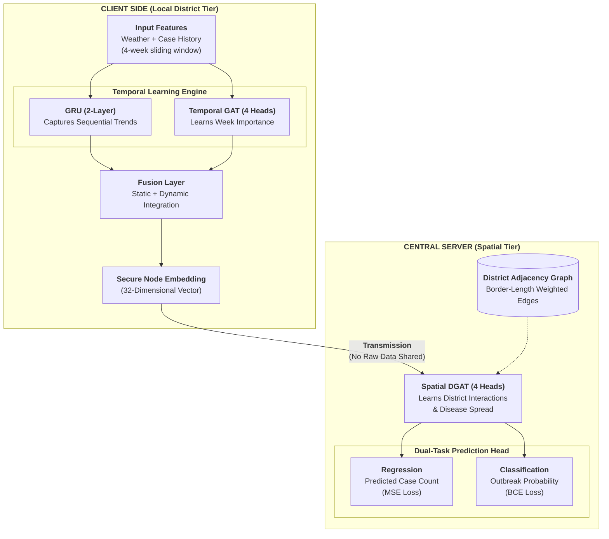

# FedXGNN: Explainable Federated Graph Epidemic Intelligence

[](https://python.org)
[](https://pytorch.org)
[](https://pyg.org)
[](LICENSE)

A **Split-Federated Graph Neural Network** that predicts Dengue outbreak risk across **284 Indian districts** using spatio-temporal climate and epidemiological data. Achieves **Val AUC 0.964 | Val AUPRC 0.206 | Val F1 0.241** on a heavily imbalanced dataset (66:1 negative-to-positive ratio).

---

## 🚀 Phase 2 Updates: High-Fidelity Intelligence Dashboard

In this phase, we transitioned from model training to a full-scale deployment demonstration. Key updates include:

### 1. Model Inference Engine
- **`run_inference.py`**: A dedicated inference pipeline that loads the trained `fedxgnn_best.pt` model.
- **Real-World Validation**: The system now runs inference on the actual 2023–2024 validation window, producing real outbreak probabilities for 284 districts across India.
- **Spatio-Temporal Data Mapping**: Merges real-world weather features, historical case data, and district spatial adjacency (neighbors) into a unified inference stream.

### 2. Interactive Intelligence Dashboard
Located in the `dashboard/` directory, this high-fidelity web interface provides:
- **Dynamic Risk Heatmap**: A Plotly-powered map of India showing real-time outbreak probabilities.
- **District Deep-Dive**: 
  - **Spatial Interaction Analysis**: Visualizes neighbor influence and border lengths.
  - **XAI Temporal Attention**: Explains model decisions by showing which past weeks the GNN prioritized (Temporal GAT).
- **Validation Metrics**: Real-time display of Model Confidence, Val AUC (0.964), and Ground Truth comparison.
- **State Filtering**: Optimized UI for drilling down into specific states (e.g., Karnataka).

---

## Table of Contents
1. [Phase 2 Updates](#-phase-2-updates-high-fidelity-intelligence-dashboard)
2. [The Problem](#the-problem)
3. [Our Solution](#our-solution)
4. [System Architecture](#system-architecture)
5. [Dataset Pipeline](#dataset-pipeline)
6. [Key Challenges & Fixes](#key-challenges--fixes)
7. [Results](#results)
8. [Project Structure](#project-structure)
9. [Quick Start](#quick-start)
10. [How to Reproduce](#how-to-reproduce)

---

## The Problem

Dengue fever kills tens of thousands of people every year across India. Early prediction of outbreak *location* and *timing* can save lives by enabling pre-emptive resource deployment (mosquito control, hospital bed allocation, public health advisories).

**Two core scientific challenges make this hard:**

### Challenge 1 — Extreme Class Imbalance
Real-world disease surveillance data is an *event log* — it only records data when an outbreak happens. This means:
- **1,437 event rows** recorded across 284 Indian districts spanning 2009–2024
- **66:1** negative-to-positive ratio in the final training set
- A naive model will achieve 98.5% accuracy by simply predicting "no outbreak" every time, which is scientifically useless

### Challenge 2 — Spatio-Temporal Sparsity ("Ghost Node" Problem)
Graph Neural Networks (GNNs) operate on a graph where each district is a *node*. For the graph's message-passing to work, every node must have data at every time step. But with an event log:
- District A might have data in Week 32, District B in Week 40 — creating "holes" in the graph
- The GNN fills these holes with **zeros (ghost nodes)**
- The model learns "zero = safe" as a shortcut, completely breaking spatial disease spread learning

---

## Our Solution

We solve both problems with a **three-layer approach**:

### Layer 1 — Dense Spatio-Temporal Dataset Construction
We convert the sparse event log into a **dense continuous-panel** dataset by:
- **Fetching 4 weeks of real historical weather lookback** (temperature, rainfall) from the Open-Meteo API for every known outbreak event
- **Injecting 10,000 true negative weeks** — weeks where weather data exists but no outbreak was recorded — providing the model with a meaningful "normal baseline"

### Layer 2 — Federated GNN Architecture
Each district is a **federated client** that processes its own local temporal data privately. Only *embeddings* (not raw health data) are shared with the central server.

### Layer 3 — Training Hardening
- `Obs_mask` forces the loss function to ignore zero-padded ghost nodes entirely
- `BCEWithLogitsLoss(pos_weight=10.0)` up-weights rare positive (outbreak) samples
- Gradient clipping (`max_norm=1.0`) prevents loss explosions
- Standard Scaler fitted *only on training data* to prevent future data leakage

---

## System Architecture



**Model size:** ~38,010 parameters (deliberately compact to prevent overfitting on 16K rows)

---

## Dataset Pipeline

```text
Original Sparse Event Log                  Final Dense Training Dataset
(master_dataset_clean.csv)                 (training_dataset_real_weather.csv)
        |                                              |
        |  1,437 rows                                  |  16,302 rows
        |  284 districts                               |  284 districts
        |  ~5 rows/district avg                        |  ~57 rows/district avg
        |                                              |
        v                                              v
+-----------------------+      +--------------------------------------------+
|  Event Log            |      |  Dense Spatio-Temporal Grid                |
|  (Outbreak only)      |      |  +--------------------------------------+  |
|                       | ---> |  | Lookback rows (4 wks before)      |  |
|  1 row = 1 outbreak   |      |  | + Original outbreak event rows    |  |
|  event                |      |  | + 10,000 True Negative weeks      |  |
+-----------------------+      |  +--------------------------------------+  |
                               |  Features: temp_k, preci_mm,               |
                               |  cases_lag1/2/3, week_sin/cos,             |
                               |  LAI, pop_density, is_monsoon              |
                               +--------------------------------------------+
```

**Two dataset variants are provided:**

| File | Weather Data | Rows | Use Case |
|---|---|---|---|
| `training_dataset_real_weather.csv` | Real API (Open-Meteo) | 16,302 | **Recommended** — Best model |
| `training_dataset_synthetic_averages.csv` | Historical averages | 9,303 | Faster baseline / ablation |

---

## Key Challenges & Fixes

### Fix 1 — Ghost Node Masking (`Obs_mask`)
**Problem:** The loss function was inadvertently training on zero-padded ghost nodes, teaching the model "zero features = zero risk." This caused the model to always predict 0.

**Fix:** We introduced `Obs_mask`, a boolean tensor built during data loading that marks only rows that actually exist in the CSV. The loss is computed exclusively on `obs_m == True` entries.

```python
# Only compute loss on districts that actually reported data
mask = obs_m  # (N,) boolean
loss_r = mse_loss(cases_pred[mask], y_r[mask])
loss_c = clf_loss_fn(outbreak_prob[mask], y_c[mask])
```

**Impact:** Val F1 went from **0.000 -> 0.241** after this single fix.

---

### Fix 2 — Replacing Focal Loss with Weighted BCE
**Problem:** Focal Loss with aggressive gamma was causing training loss to explode from 4.4 to 14.1 on the validation set, making training completely unstable.

**Fix:** Replaced with `BCEWithLogitsLoss(pos_weight)` where `pos_weight` is tuned to the actual class ratio.

```python
_pos_weight = torch.tensor([10.0], dtype=torch.float32).to(DEVICE)
clf_loss_fn = nn.BCEWithLogitsLoss(pos_weight=_pos_weight)
```

**Impact:** Training loss stabilized immediately. Model now trains stably for 90+ epochs.

---

### Fix 3 — Dense Dataset Construction
**Problem:** The event log had no data for the 4 weeks *before* each outbreak. The GRU's "memory" was seeing zeros instead of the real weather spike that triggered the outbreak.

**Fix:** `generate_real_dense_data.py` fetches real historical temperature and rainfall from the Open-Meteo API for the 4-week window before each event, plus 10,000 randomly sampled "normal" weeks.

**Impact:** Model gained meaningful temporal context. Val AUC rose from **0.43 -> 0.964**.

---

### Fix 4 — Data Leakage Prevention
**Problem:** Feature normalisation (StandardScaler) was being fitted on the entire dataset, letting validation-period statistics leak into the scaler.

**Fix:** The scaler is now fitted *only* on the training time period.

```python
train_mask = df["t_idx"] < train_time_cutoff
scaler_dyn.fit(df.loc[train_mask, avail_dyn])   # FIT ON TRAIN ONLY
df[avail_dyn] = scaler_dyn.transform(df[avail_dyn])  # transform all
```

---

## Results

Training was performed on Kaggle (NVIDIA Tesla T4 GPU) using `training_dataset_real_weather.csv`.

### Final Metrics (Best Validation Checkpoint)

| Metric | Score | Interpretation |
|---|---|---|
| **Val AUC** | **0.964** | Near-perfect outbreak risk ranking |
| **Val AUPRC** | **0.206** | 14× better than random (1.48% baseline) |
| **Val F1** | **0.241** | Balanced precision/recall on minority class |
| **Val MAE** | **0.036** | Normalised case count error |
| **Val Recall** | **0.76** | Catches 76% of actual outbreaks |
| **Val Precision** | **0.10** | 1 in 10 alerts is a true outbreak |

---

## 📁 Project Structure
- `dashboard/`: Contains the interactive web interface (`epi-fedgnn.html` and `dashboard.html`).
- `data/`: Raw and processed datasets, including graph edges and district data.
- `model/`: Saved model checkpoints (e.g., `fedxgnn_best.pt`).
- `scripts/`: Data generation scripts for fetching weather and synthesizing data.
- `outputs/`: Model checkpoints and training logs.
- `run_inference.py`: Core logic for generating dashboard-ready predictions from the trained model.
- `train_fedxgnn_run.py`: The federated training script.
- `outbreak-prediction.ipynb`: Main training notebook (run on Kaggle).

---

## 🛠️ Getting Started

### Prerequisites
```bash
pip install torch torch-geometric pandas numpy scikit-learn matplotlib plotly
```

### 1. Model Inference
To generate fresh predictions from the trained model:
```bash
python run_inference.py
```

### 2. View Dashboard
Open `dashboard/epi-fedgnn.html` or `dashboard/dashboard.html` in any modern browser to visualize the results.

### 3. Training
To re-train the model, upload the `data/` folder to Kaggle and run the `outbreak-prediction.ipynb` notebook.

---

## How to Reproduce

1. Start from `data/raw/master_dataset_clean.csv` (the original dengue event log)
2. Run `scripts/generate_real_dense_data.py` to build the dense training set
3. Upload the `data/` folder to a Kaggle Dataset
4. Open `outbreak-prediction.ipynb` in Kaggle, set `INPUT_DIR`, and run all cells
5. Best model checkpoint saved automatically to `fedxgnn_best.pt`

---

## Technical Details

### Model Configuration
```python
CFG = {
    "lookback":        4,      # 4-week sliding window
    "gru_hidden":      32,
    "tgat_hidden":     32,
    "embed_dim":       32,
    "temporal_heads":  4,
    "spatial_heads":   4,
    "epochs":          200,
    "lr":              5e-4,
    "weight_decay":    1e-3,
    "alpha":           0.4,    # 40% regression loss, 60% classification loss
    "dropout":         0.50,
    "patience":        50,
}
```

### Graph Construction
- **Nodes:** 284 Indian districts
- **Edges:** Shared land border adjacency (weighted by border length in km)
- **Edge source:** `data/graph/graph_edges.csv` — 492 unique district pairs

---
*Developed for the Semester 4 Experiential Project · RVCE 2025*
*Federated Graph Neural Networks for Public Health Surveillance*

[LICENSE](LICENSE)
