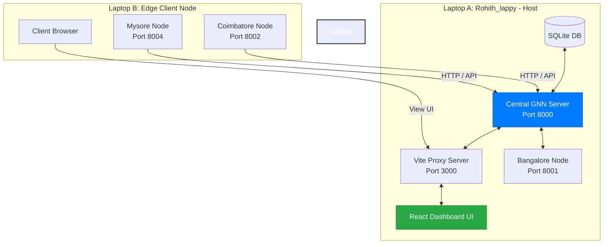

# FedXGNN — Execution Guide for `Rohith_lappy` (Central Host Setup)

This guide provides instructions to run the **FedXGNN Split-Federated Epidemic Forecasting Platform** in a multi-laptop Local Area Network (LAN) setup. 

In this configuration, your laptop **`Rohith_lappy`** serves as the central orchestration node, running the central server, database, React dashboard, and the Bangalore hospital client. A second laptop (**Laptop B**) will connect to your machine via the LAN to run the Coimbatore and Mysore hospital clients.

---

## 📐 Deployment Topology



---

## 📡 LAN & Network Preparation

Because Windows Defender Firewall blocks incoming local ports on public networks, make sure you configure the network connection correctly:

1. **Connect both laptops to the same Wi-Fi or LAN router**.
2. **Set the connection profile to Private** on both laptops:
   - On Windows: Go to **Settings > Network & Internet > Wi-Fi/Ethernet**, click your connection properties, and select **Private**.
3. **Configure the Hostname Fallback IP Address**:
   > [!IMPORTANT]
   > The Windows hostname `Rohith_lappy` contains an underscore (`_`), which is technically a non-RFC compliant character. While some operating systems resolve it, other systems (especially Linux/macOS clients) might fail to resolve `http://Rohith_lappy.local:8000`.
   >
   > To guarantee communication, **obtain your Laptop's LAN IP address**:
   > 1. Open Command Prompt on `Rohith_lappy` and run:
   >    ```cmd
   >    ipconfig
   >    ```
   > 2. Look for the **IPv4 Address** under your active Wi-Fi or Ethernet adapter (e.g., `192.168.1.15`). 
   > 3. We will refer to this address as `<Laptop_A_IP>` below.

---

## 💻 Running on `Rohith_lappy` (Laptop A — Central Server)

Open three separate Command Prompt or PowerShell windows on `Rohith_lappy` and execute the following:

### Step 1: Run the GNN Server (Terminal 1)
The Central GNN Server listens on `0.0.0.0:8000` to handle predictions, explainable AI (XAI) engine requests, and federated learning weight aggregation. It automatically parses `GROQ_API_KEY` from the [.env](file:///c:/4th%20sem%20el/code/Explainable-Federated-Learning-Framework-for-Early-Epidemic-Forecasting/.env) file to generate clinical reports using Llama-3.

```cmd
venv\Scripts\python backend/server.py
```
* **Verify**: Look for `[BOOT] Ready — 284 districts, 728 timesteps, 724 windows` in the log output.

### Step 2: Run the Vite React Frontend (Terminal 2)
The React client interfaces with the server through a proxy defined in [frontend/vite.config.js](file:///c:/4th%20sem%20el/code/Explainable-Federated-Learning-Framework-for-Early-Epidemic-Forecasting/frontend/vite.config.js).

```cmd
cd frontend
npm run dev
```
* **Verify**: The console should show Vite is running on `http://localhost:3000` (or `3001` if port `3000` is in use).

### Step 3: Run the Bangalore Hospital Client (Terminal 3)
Start the local client dashboard representing the Bangalore region:

```cmd
venv\Scripts\python client/client_app.py --port 8001 --censuscode 572 --name "Bangalore Hospital" --server http://localhost:8000
```
* **Verify**: Access the portal locally at [http://localhost:8001](http://localhost:8001).

---

## 💻 Running on Laptop B (Edge Clients)

Open separate command prompts or terminal screens on Laptop B to spin up the remaining hospital nodes:

### Step 1: Start Coimbatore Hospital Client (Terminal 1)
Run the client node. Replace `<Laptop_A_IP>` with the IPv4 address of `Rohith_lappy` (e.g. `192.168.1.15`).

* **On Windows**:
  ```cmd
  venv\Scripts\python client/client_app.py --port 8002 --censuscode 632 --name "Coimbatore Hospital" --server http://<Laptop_A_IP>:8000
  ```
* **On Linux / macOS**:
  ```bash
  python3 client/client_app.py --port 8002 --censuscode 632 --name "Coimbatore Hospital" --server http://<Laptop_A_IP>:8000
  ```

### Step 2: Start Mysore Hospital Client (Terminal 2)
Run the client node. Replace `<Laptop_A_IP>` with the IPv4 address of `Rohith_lappy`.

* **On Windows**:
  ```cmd
  venv\Scripts\python client/client_app.py --port 8004 --censuscode 577 --name "Mysore Hospital" --server http://<Laptop_A_IP>:8000
  ```
* **On Linux / macOS**:
  ```bash
  python3 client/client_app.py --port 8004 --censuscode 577 --name "Mysore Hospital" --server http://<Laptop_A_IP>:8000
  ```

### Step 3: Open the Central Dashboard
On Laptop B, open any web browser and go to:
```
http://<Laptop_A_IP>:3000
```
*(or port `3001` if Vite picked that port on start).* This allows Laptop B to view and interact with the central spatial outbreak map.

---

## 🔍 Verification & Presentation Walkthrough

Once everything is up, run through this scenario flow to demonstrate the framework:

### 1. Ingesting EHR Clinical Data
1. Open the **Bangalore Hospital Portal** (`http://localhost:8001` on Laptop A) or **Coimbatore Hospital Portal** (`http://localhost:8002` on Laptop B).
2. Find the **EHR Ingestion Panel** and drag-and-drop the sample text file `ehr_samples/patient_dengue_pos_99F.txt` into the box.
3. Observe how the local clinical symptom NLP parsing automatically extracts dengue symptoms and increases the hospital's weekly symptom counters.

### 2. Transmitting Embeddings to the Central Server
1. Click **Transmit Embeddings** on the client dashboard.
2. The GNN model generates a local 64-dimensional temporal representation and transmits it to the central database server.
3. Open the **Central Dashboard** (`http://localhost:3000` on Laptop A or `http://<Laptop_A_IP>:3000` on Laptop B).
4. Verify that the client list updates to show the hospital is **Active** (green status indicator) and has synced.

### 3. Visualizing Regional Predictions & XAI Heatmaps
1. Navigate to the map on the central dashboard and select the district (e.g. Bangalore or Coimbatore).
2. The model aggregates the surrounding spatial border metrics and makes an outbreak alert calculation.
3. Observe the **Temporal SHAP interpretability chart** at the bottom. Check how factors like monsoon, temperature, and historic lag influence the outbreak risk dynamically.

---

## 🛠️ Troubleshooting

* **Connection Timeout / Network Unreachable**:
  Double-check that both laptops are on the exact same Wi-Fi connection, and check if you can ping `Rohith_lappy`'s IP from Laptop B:
  ```bash
  ping <Laptop_A_IP>
  ```
  If ping works but port `8000` does not, open **Windows Defender Firewall** on `Rohith_lappy` and check if port `8000` (Python server) and port `3000` (Vite dev server) are open for incoming connections.
  
* **Invalid Port / Port Already Bound**:
  If any port is already in use, find the process and kill it:
  - On Windows Command Prompt:
    ```cmd
    netstat -ano | findstr :8000
    taskkill /F /PID <PID_Found>
    ```
  - On Linux / macOS:
    ```bash
    kill -9 $(lsof -t -i:8000)
    ```
