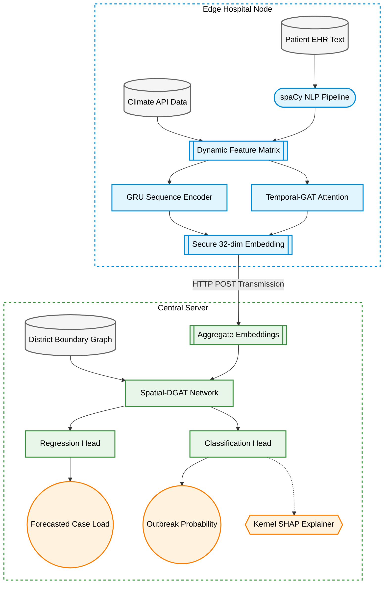

# EPI-FLAME: Poster Content

## Introduction
This project introduces EPI-FLAME, an Explainable Privacy-Preserving Federated Learning Architecture designed for early epidemic forecasting. It aims to predict vector-borne disease outbreaks, such as Dengue fever, across hundreds of districts. The system achieves this by combining secure, edge-based hospital clinical text extraction using Natural Language Processing with a centralized spatial Graph Neural Network to map disease spread without exposing patient data.

## Problem Definition
Data Silos: Stringent healthcare privacy laws prevent hospitals from centralizing their critical patient records. This traps valuable early-warning diagnostic data in isolated institutional silos, severely limiting the capabilities of traditional epidemic forecasting models.

Spatial Sparsity: Epidemiological datasets often suffer from sparse reporting. In traditional graph models, districts that fail to report data are treated as zero-padded ghost nodes. Message passing algorithms misinterpret these missing values as absolute zero-risk signals, corrupting the entire spatial network and degrading predictive accuracy.

Black-Box AI: High-accuracy deep learning models, particularly complex spatio-temporal graph networks, operate as impenetrable black boxes. They fail to provide the transparency required for public health officials to trust the forecasts and confidently allocate resources or declare medical emergencies.

## Objectives
Privacy-First Prediction: To design a split-federated Graph Neural Network that can accurately predict localized outbreaks and forecast case loads without ever requiring the transmission of raw, identifiable patient data to a central server.

Unstructured Data Utilization: To deploy a localized Named Entity Recognition NLP pipeline at the hospital edge. This allows the system to securely extract early-warning symptoms directly from raw clinical intake notes, capturing critical anomalies before formal diagnostic codes are assigned.

Clinical Trust and XAI: To integrate a robust explainability engine using Kernel SHAP. This ensures that every forecasted alert is accompanied by clear, human-in-the-loop justifications mapping the prediction directly to specific climatic and clinical triggers.

## Methodology
The system architecture separates local temporal learning from global spatial forecasting to maximize privacy and efficiency.

## Tools Used
Programming and Backend: Python serves as the core language, with FastAPI and Uvicorn managing asynchronous REST API orchestration between the edge clients and the central server.

AI and Machine Learning: PyTorch and PyTorch Geometric power the deep learning architecture, encompassing the GRU and GAT components. The spaCy library handles NLP extraction, and the SHAP library drives the Explainable AI engine.

Visualization and Frontend: React and Vite are utilized to build a high-performance web dashboard. Plotly is integrated to render dynamic, interactive geographical heatmaps and spatial graph visualizers.

External Data Integration: The Open-Meteo API is queried to inject real-time and historical climate sequences, such as temperature and precipitation, into the local hospital feature matrices.

## Results and Discussions
High Precision Validation: When tested on a heavily imbalanced epidemiological dataset with a 66 to 1 negative-to-positive ratio, EPI-FLAME achieved a Validation Area Under the Precision-Recall Curve of 0.780 and an Area Under the ROC Curve of 0.849, demonstrating exceptional anomaly detection capabilities.

Ghost Node Resolution: The introduction of a dynamically masked Binary Cross Entropy loss function successfully neutralized unreporting nodes. This prevented the graph corruption commonly seen in sparse surveillance logs and stabilized the learning process.

Actionable Insights: The optimized SHAP engine, utilizing a deterministic historical background profile, successfully generated highly legible clinical and climatic feature attributions. This allowed administrators to clearly see the exact environmental variables driving each alert.

## Conclusions
The integration of Federated Learning, Natural Language Processing, and Spatial Graph Neural Networks provides a powerful paradigm for epidemic surveillance that completely circumvents patient privacy bottlenecks.

Securely parsing unstructured clinical text at the network edge allows the system to capture critical early-warning health anomalies significantly faster than relying on delayed centralized diagnostic registries.

Furthermore, integrating deterministic explainability mechanisms is essential for establishing the operational trust necessary for deploying advanced AI models in high-stakes public health environments.

## Outcome of the Work
The project delivers a fully deployable, interactive dashboard that visualizes real-time, district-level outbreak risks by aggregating telemetry from multiple federated hospital nodes. It proves that decentralized edge-intelligence can drive highly accurate, secure, and resilient early-warning systems, empowering healthcare authorities to execute proactive interventions and optimize resource allocation.

## References
[1] W. Fu, H. Li, Y. Liu, S. Xia, and H. Chen, "Privacy-Preserving Individual-Level COVID-19 Infection Prediction via Federated Graph Learning," ACM Trans. Inf. Syst., vol. 42, no. 4, pp. 1–28, Apr. 2024.

[2] C. Hausleitner, H. Mueller, A. Holzinger, and B. Pfeifer, "Collaborative weighting in federated graph neural networks for disease classification with the human-in-the-loop," Sci. Rep., vol. 14, p. 21839, Sep. 2024.
